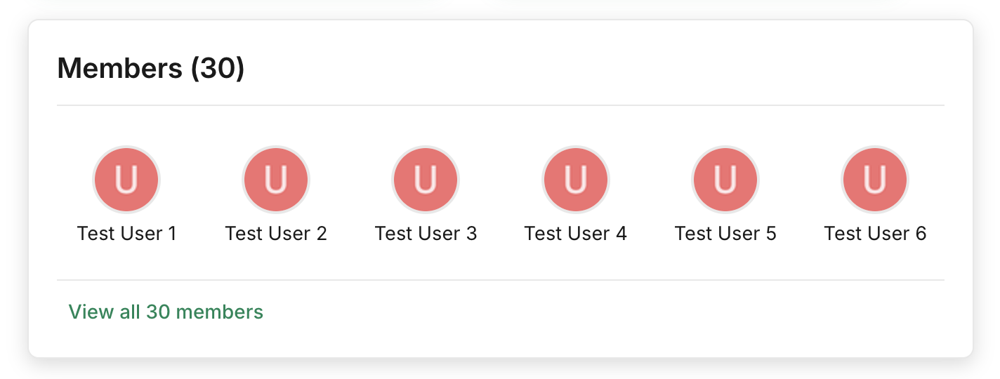
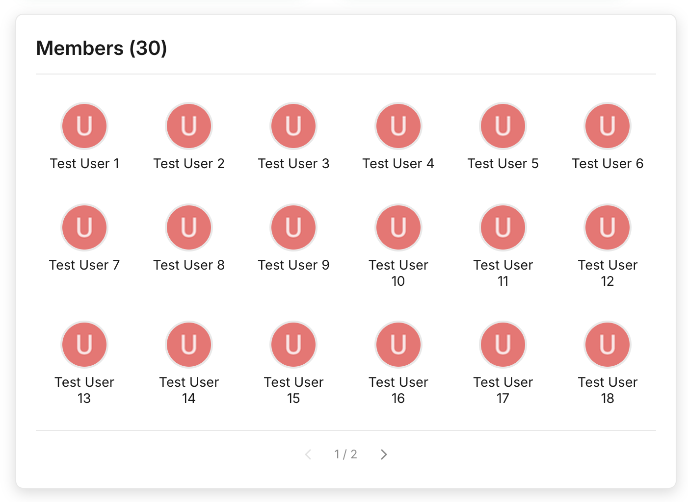

# Discourse Category Member Directory

A Discourse theme component that displays a member directory card on category pages, showing avatars and names of users who can access that category.

### Collapsed View (default)


### Expanded View


## Features

- **Collapsed by default** - Shows first row of members with "View all" link
- **Expandable** - Click to show up to 3 rows of members
- **Pagination** - Navigate through large member lists when expanded
- **Auto-match by slug** - Zero config if category slugs match group names
- **Mobile responsive** - Optimized for all screen sizes
- **Direct profile links** - Click any member to visit their profile
- **Theme-aware styling** - Respects your forum's color scheme

## Installation

1. Go to your Discourse Admin Panel
2. Navigate to **Customize → Themes → Components**
3. Click **Install** → **From a git repository**
4. Enter the repository URL (or upload as a ZIP)
5. Add the component to your active theme

## Configuration

After installation, the component works out of the box with **auto-matching enabled by default**.

### Default Behavior: Auto-Match by Slug

The component automatically matches category slugs to group names. For example:
- Category slug: `team-hub` → Looks for group: `team-hub`
- Category slug: `developers` → Looks for group: `developers`

**No configuration needed if your category slugs match your group names!**

### Optional: Add Prefix/Suffix

If your groups follow a naming convention:

```yaml
group_slug_prefix: "cat-"        # Category "team-hub" → Group "cat-team-hub"
group_slug_suffix: "-members"    # Category "team-hub" → Group "team-hub-members"
```

### Optional: Manual Mapping for Exceptions

**Category Group Mapping** (`category_group_mapping`)
- Maps specific category IDs to group names
- Format: `categoryId:groupName|categoryId:groupName`
- Example: `5:team-members|10:developers|15:moderators`

**Note:** Manual mappings take priority over auto-matching, so you can use both for hybrid setups.

To find your category ID:
1. Visit the category page
2. Check the URL: `/c/category-name/{id}`
3. Or use the browser console: `Discourse.Site.currentProp('categories').find(c => c.name === 'Your Category').id`

### Optional Settings

- **Members Per Page** (`members_per_page`) - Default: 20
  - Number of member avatars to display per page
  
- **Show Member Names** (`show_member_names`) - Default: true
  - Display member names below avatars
  
- **Card Title** (`card_title`) - Default: "Members"
  - Title displayed at the top of the member directory
  
- **Show Member Count** (`show_member_count`) - Default: true
  - Show total member count in the title (e.g., "Members (42)")

## Example Configuration

### Example 1: Zero Config (Default)

If your category slugs match your group names, it just works! No configuration needed.

### Example 2: Auto-Match with Prefix

Your groups all have a `category-` prefix:
- Category: `team-hub` / Group: `category-team-hub`
- Category: `developers` / Group: `category-developers`

```yaml
auto_match_by_slug: true
group_slug_prefix: "category-"
```

### Example 3: Manual Mapping

Your categories and groups have different names:
- Category ID 5: "Team Hub" / Group: "team-members"
- Category ID 10: "Dev Corner" / Group: "developers"

```yaml
category_group_mapping: 5:team-members|10:developers
```

### Example 4: Hybrid (Flexible)

Most categories auto-match, but a few need custom mapping:

```yaml
auto_match_by_slug: true
category_group_mapping: 15:special-team|20:vip-members
```

Categories 15 and 20 will use the manual mapping, all others will auto-match.

## How It Works

1. The component appears at the top of category pages (above subcategory boxes)
2. It reads the current category ID from the page context
3. Looks up the corresponding group name from your mapping
4. Fetches members from the Discourse API (`/groups/{name}/members.json`)
5. Displays members in a responsive grid with avatars and optional names
6. Provides pagination controls to navigate through all members

## API Permissions

The component uses the public Discourse API endpoint `/groups/{name}/members.json`. This endpoint:
- Works for public and semi-public groups
- Respects group visibility settings
- Does not require admin access

## Compatibility

- Discourse version: 2.8+
- Mobile: Fully responsive
- Theme: Compatible with all Discourse themes

## Troubleshooting

### Members not showing?

1. **Check the category ID** - Ensure it matches your category
2. **Verify group name** - Group names are case-sensitive and should match exactly
3. **Check group visibility** - The group must allow members to be listed
4. **Browser console** - Look for error messages in the developer console

### Wrong members displayed?

- Verify your `category_group_mapping` setting
- Ensure the group name matches the actual Discourse group slug

## Contributing

Contributions are welcome! Please feel free to submit a Pull Request.

## License

MIT License - see [LICENSE](LICENSE) file for details

## Support

For issues or questions:
- Open an issue on GitHub
- Ask on the Discourse Meta forum
- Check the Discourse developer documentation

---

**Note:** This component requires categories to be mapped to groups via theme settings. The Discourse API does not expose category permissions publicly, so manual configuration is required.
